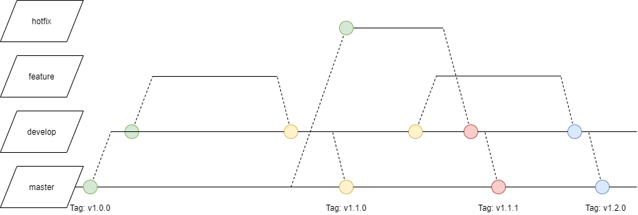

# Contributing Guide

This document shows you how you can contribute to the project

## General

In general, please consider [Contribution guidelines to Open Source Projects](http://www.contribution-guide.org/#).

## Submitting changes

- Clone the repository
- Check out a new branch based on what you're going to do:
  - Example:
    ````
    $ git checkout -b BRANCH_NAME
    ````
    If you get an error, you may need to fetch first by using
    ````
    $ git remote update && git fetch
    ````
  - Use one branch per fix / feature
- Commit your changes
  - Please provide a git message that explains what you've done
  - Commit your changes to your local repository
  - Example:
    ````
    $ git commit
    ````
- Push to the remote branch
  - Example:
    ````
    $ git push origin BRANCH_NAME
    ````
- Make a Merge Request / Pull request
  - Make sure you send the PR to the <code>BRANCH_NAME</code> branch
  - Assign the request to a maintainer

### Conventions

#### Branching

Base each development is ```master```-Branch (or ```main```). This portraits a stable, tested status. The commits of this branch hold tags for the according versions.  

Based on the ```master```-Branch a branch ```develop``` will be created, which is base for single features and will be merged into the master with each new version. Tags with the according versions will be created.

Each new feature will be developed in a ```feature```-Branch, which holds each commit for its development. After the development a review will occur, if everything is fine, it will be merged into the ```develop```-Branch. Please consider Namingconventions.

If there are any bugs detected in the ```master```-Branch, fixes should be made in a ```hotfix```-Branch. This will be created based on the master-Branch and will be merged into develop and subsequently into the master. Please consider Namingconventions.



#### Naming

| branch-type | example                 | description                                                             |
|-------------|-------------------------|-------------------------------------------------------------------------|
| feature     | f/123-short-description | branch contains implementation of feature 123, with a short description |
| hotfix      | h/566-short-description | branch contains fix of bug 566, with a short description                |
| develop     | develop                 | a repository's development-branch                                       |
| master      | master                  | a repository's main-branch                                              |

In order to provide a fast identification, whether a feature or bugfix is being handled in a branch, naming-conventions are required.

This also enables filtering via git e.g.

```git branch --list 'f*'```

Also it enables a CI/CD-toolchange automated processing, which can lead to varying actions based on the branch-type.  

#### Commit-Messages

A template enables us to have the same structure for each commit-message. Independent of the branch a commit-message will let you know, what exactly was being developed.

A commit-template provides the possibility to automatically generate changelogs.

In order to use a commit-template, edit your .gitconfig as follows:

```
[commit]
template = ~/.gitmessage
```
and provide a .gitmessage in your user-home.

Here is an example of a .gitmessage-file in SDK-environment:

```
<type>: <description>
#-------------- 50 characters ------------------|
 
ADDED:
-
 
CHANGED:
-
 
DELETED:
-
 
 
REFS: <storynumber>
 
 
#--------------- 72 characters ---------------------------------------|
 
# DESCRIPTION
#
# <type>:
#
# feat:     (new feature for the user, not a new feature for build script)
# fix:      (bug fix for the user, not a fix to a build script)
# docs:     (changes to the documentation)
# style:    (formatting, missing semi colons, etc; no production code change)
# refactor: (refactoring production code, eg. renaming a variable)
# test:     (adding missing tests, refactoring tests; no production code change)
#
```
