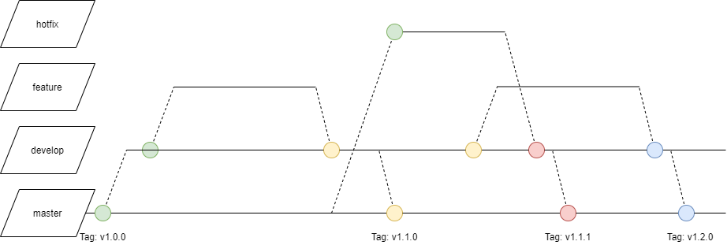

## Branching Guidelines

### Branching

The ```main```-branch portraits a stable, tested status. 

The ```develop```- branch is based on the ```main```-branch for single features and will be merged into the main with each new version. 

Each new feature will be developed in a ```feature```-Branch, which holds each commit for its development. After the development a review will occur, if everything is fine, it will be merged into the ```develop```-Branch. Please consider [naming](#naming) conventions.

If there are any bugs detected in the ```main```-Branch, fixes should be made in a ```hotfix```-Branch. This will be created based on the main-Branch and will be merged into develop and subsequently into the main. Please consider [naming](#naming).



### Naming

| branch-type | example                 | description                                                             |
|-------------|-------------------------|-------------------------------------------------------------------------|
| feature     | f/123-short-description | branch contains implementation of feature 123, with a short description |
| hotfix      | h/566-short-description | branch contains fix of bug 566, with a short description                |
| develop     | develop                 | a repository's development-branch                                       |
| main        | main                    | a repository's main-branch                                              |

In order to provide a fast identification, whether a feature or bugfix is being handled in a branch, naming-conventions are required.

This also enables filtering via git e.g.

```git branch --list 'f*'```

Also, it enables a CI/CD-tool change automated processing, which can lead to varying actions based on the branch-type.
