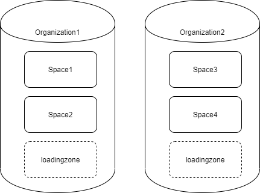
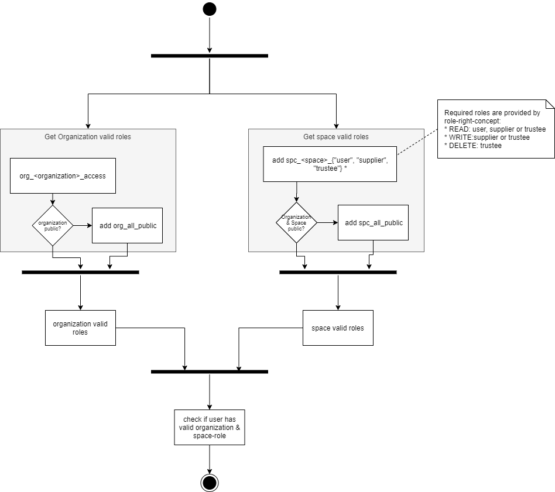
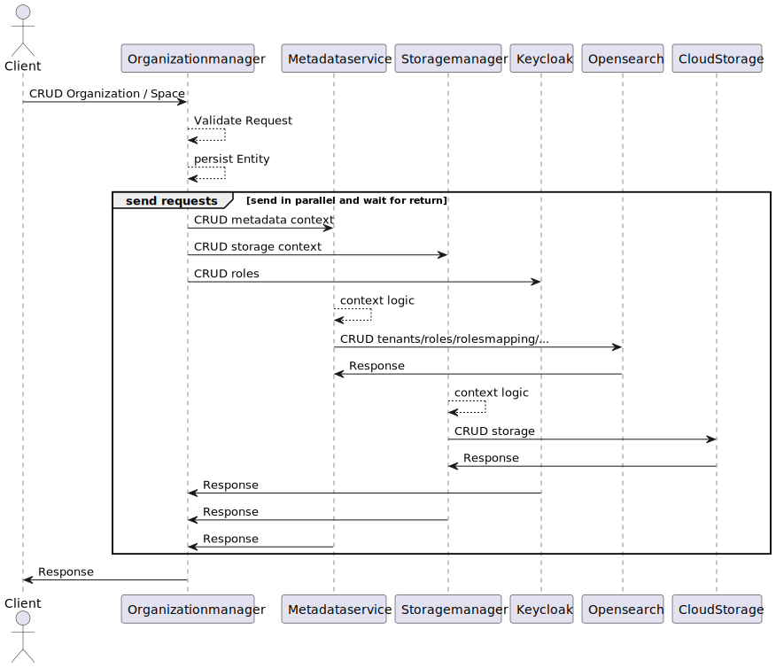

# Organizationmanager


The Organizationmanager is a service of the Superb Data Kraken for the management of organizations and spaces.

SDK is organized in organizations and spaces, where a space represents a use-case and an organization packages use-cases.

On a technical level, an organization corresponds to a Storage Account, whereas a space corresponds to a Container. Each organization has a dedicated "
Container" called 'loadingzone', which
serves as an intermediate store for incoming data. After processing, this data will be moved to the main-storage (target-space) - however this is out of this
service's
scope.

In addition to organizations and spaces, the organizationmanager manages the authorization for these. For information on which roles exist and what they are
authorized for, please refer to the roles/rights concept (**TODO:** <insert-public-link-here>).
If users require authorization to a certain organization/space, they can request access ("`UserRequest`") with the desired roles. An administrator (or owner)
can then grant permission or deny it. An administrator (or owner) can also directly grant permissions to users.

---
**NOTE on organization's confidentiality**

The organizations confidentiality marks the minimum-confidentiality of its spaces. Though a PRIVATE organization may have PUBLIC spaces, they will be ignored in
role-checks.


### Installing


Execute the following steps to set up your local environment for development and testing:

- Clone the repository
- [Connect to Azure Artifacts-Feed](https://dev.azure.com/EFSCIS/EFS-SDK/_packaging?_a=connect&feed=sdk-snapshots) -> Select Maven and edit
  your ```settings.xml``` according to the instructions
- copy-paste application-local-template.yml into application-local.yml and check for necessary adjustments to your environment.
- start local postgres instance with
  ```docker run --name postgres -d -p 5432:5432 -e POSTGRES_PASSWORD=password postgres```
- set "Active profiles" to "local" within your IDE
- Run "OrganizationManagerApplication" (preferably through your IDE)
- access swagger under http://localhost:8090/organizationmanager/swagger-ui/index.html

## Usage


Commands that are required in order to use the service.

- <code>mvn package</code> to build the service
- <code>mvn test</code> to execute the tests
- <code>mvn spring-boot:run</code> to run a spring service
- <code>docker build</code> for building the docker container

## Deployment


For deployment push the service to Azure DevOps, the pipeline will start automatically for development (deploys to development environment) and master (deploys
to production environment) branches. For feature branches, please start it manually. The deployment manifest
is [azure-pipeline-prod.yml](azure-pipeline-prod.yml) for production environment (prod cluster) and [azure-pipeline-dev.yml](azure-pipeline-dev.yml) for
development environment (dev cluster).


### Build/Deployment steps

- Build and Push: an image is built using the [Dockerfile](Dockerfile) and pushed to the corresponding ACR (SDK or AICloud).
- Deployment: kubernetes manifests are deployed to the corresponding AKS (SDK or AICloud):
    - [config-map.yml](kubernetes/config-map.yml) writes the spring boot configuration application.yml as a config map
    - [rbac.yml](kubernetes/rbac.yml) gives permission for backend namespace
    - [deployment.yml](kubernetes/deployment.yml)  yields the k8 deployment "organizationmanager", i.e. describes the desired state for Pods and ReplicaSets
    - [service.yml](kubernetes/service.yml) yields the corresponding k8 service "organizationmanager", i.e. an abstract way to expose an application running on
      a set of Pods as a network service.
    - [ingress.yml](kubernetes/ingress.yml) yields the ingress "organizationmanager" to the service, i.e. manages external http access to the service in the
      cluster via the public IP https://aicloud.efs.ai/organizationmanmager/
- When deploying to the development environment (dev cluster) the kubernetes manifests that are applied are set up for dev using extra variables (
  i.e. `postfix`) or files (i.e. `ingress-dev.yml`)

### Service connections


For setting up the pipelines, the following service connections are needed in Azure Devops -> Project Settings:


#### Docker Registry service connection

- for SDK tenant: sc-efs-sdk-acrsdk (type: Azure Container Registry).
    - NOTE: dev environment uses the same registry from SDK tenant

- for AICloud tenant: sc-efs-sdk-acraicloud (type: others)
    - docker registry: https://acraicloud.azurecr.io/
    - docker id: acraicloud
    - docker password: obtained from portal -> ACR -> access keys -> enable admin user -> copy password

#### Kubernetes service connection

- for SDK tenant:
    - sc-efs-sdk-aks-sdk_devops (prod environment)
    - sc-efs-sdk-aks-sdk-dev_devops (dev environment)
- for AICloud tenant:
    - sc-efs-sdk-aks-aicloud_devops

Both are of type Service Account and have the following parameters

- server url: obtained (as described in Azure DevOps) from
  ```bash
  kubectl config view --minify -o jsonpath={.clusters[0].cluster.server}
  ```
- secret: obtained from
    ```bash
  kubectl get serviceAccounts <service-account-name> -n <namespace> -o=jsonpath={.secrets[*].name}
  ```
  where namespace is default and the service account is e.g. appreg-aicloud-aks-main.

---


### Pipeline Variables


The following pipeline variables are required:

| name                            | example                       |
|---------------------------------|-------------------------------|
| dockerRegistryServiceConnection | sc-efs-sdk-acraicloud         |
| kubernetesServiceConnection     | sc-efs-sdk-aks-aicloud_devops |
| environment                     | aicloud                       |
| DOMAIN                          | aicloud.efs.ai                |

The container registry service connection is established during pipeline creation.


## Built With

- Maven v3.6.3 (see this [Link](https://maven.apache.org/))

## Contributing


See the [Contribution Guide](CONTRIBUTING.md).


## Changelog


See the [Changelog](CHANGELOG.md).


## Documentation


### Organization and Space Management


Storage is organized in organizations and spaces, where a space represents a use-case and an organization packages use-cases. On a technical level (assuming
Azure as the
storage provider), an organization corresponds to a Storage Account, whereas a space corresponds to a Container. Each organization has a dedicated "Container"
called 'loadingzone', which
serves as an intermediate store for incoming data. After processing, this data will be moved to the main-storage (target-space) - however this is out of this
service's
scope.



Available endpoints for storage-organization:

- organization-management:
    - ```POST /api/v1.0/organization``` Creates an organization
    - ```GET /api/v1.0/organization?permissions={permissions}``` Get all organizations (optionally filtered by given permissions)
    - ```GET /api/v1.0/organization/{id}``` Gets organization by id
    - ```GET /api/v1.0/organization/name/{name}``` Gets organization by name
    - ```PUT /api/v1.0/organization/{id}``` Updates an organizations
- organization-userrequest-management:
    - ```PUT /api/v1.0/userrequest/{orgaId}/userrequests/{id}/decline``` Decline organization-userrequest
    - ```PUT /api/v1.0/userrequest/{orgaId}/userrequests/{id}/accept``` Accept organization-userrequest
    - ```GET /api/v1.0/userrequest/{orgaId}/userrequests``` Gets organization-userrequests
    - ```POST /api/v1.0/userrequest/{orgaId}/userrequests``` Create organization-userrequest
- organization-user-management:
    - ```GET /api/v1.0/organization/{orgaId}/users``` Gets users in organization
    - ```PUT /api/v1.0/organization/{orgaId}/users/{userId}``` Set organization-roles to user
- space-management:
    - ```POST /api/v1.0/space/{orgaId}``` Creates a space
    - ```GET /api/v1.0/space/{orgaId}?permissions={permissions}``` Get all spaces within the given organization (optionally filtered by given permissions)
    - ```GET /api/v1.0/space/{orgaId}/{spaceId}``` Gets space by id
    - ```GET /api/v1.0/space/{orgaId}/name/{spaceName}``` Gets space by name
    - ```PUT /api/v1.0/space/{orgaId}/{spaceId}``` Updates a space
    - ```DELETE /api/v1.0/space/{orgaId}/{spaceId}``` Deletes space
    - ```PUT /api/v1.0/space/{orgaId}/{spaceId}/setDeletionState``` Sets a state for the suitable space for deletion operation
- space-user-management:
    - ```GET /api/v1.0/space/{orgaId}/space/{spaceId}/users``` Gets users in space
    - ```PUT /api/v1.0/space/{orgaId}/space/{spaceId}/users/{userId}``` Set space-roles to user
- space-userrequest-management:
    - ```PUT /api/v1.0/userrequest/{orgaId}/space/{spaceId}/userrequests/{id}/decline``` Decline space-userrequest
    - ```PUT /api/v1.0/userrequest/{orgaId}/space/{spaceId}/userrequests/{id}/accept``` Accept space-userrequest
    - ```GET /api/v1.0/userrequest/{orgaId}/space/{spaceId}/userrequests``` Gets space-userrequests
    - ```POST /api/v1.0/userrequest/{orgaId}/space/{spaceId}/userrequests``` Create space-userrequest

An organization consists of:

| Attribute       | Description                               | Example                                                                                                                                                                             |
|-----------------|-------------------------------------------|-------------------------------------------------------------------------------------------------------------------------------------------------------------------------------------|
| name            | name of the organization                  | company, department                                                                                                                                                                 |
| description     | description of the organization           |                                                                                                                                                                                     |
| displayName     | display-name of the organization          |                                                                                                                                                                                     |
| confidentiality | confidentiality of the organization       | PUBLIC: organization visible for all logged in users<br>INTERNAL: only for users with special roles visible<br>PRIVATE: INTERNAL + only for users that know the organization exists |
| state           | state of the organization                 | OPEN: data can be supplied<br>CLOSED: space was finalized <br/>- project finished or the like, candidate for deletion<br>LOCKED: space was being locked, no changes possible        |
| created         | timestamp of organization-creation        | UTC time                                                                                                                                                                            |
| modified        | timestamp of organization-modification    | UTC time - automatically updated on each update                                                                                                                                     |
| tags            | tags to describe the organization         |                                                                                                                                                                                     |
| appConfig       | list of application-configurations        |                                                                                                                                                                                     |
| company         | company owning the organization           | e:fs TechHub GmbH                                                                                                                                                                   |
| owners          | list of references to organization-owners |                                                                                                                                                                                     |

A space consists of:

| Attribute              | Description                                                  | Example                                                                                                                                                                                               |
|------------------------|--------------------------------------------------------------|-------------------------------------------------------------------------------------------------------------------------------------------------------------------------------------------------------|
| name                   | name of the space                                            | projectname                                                                                                                                                                                           |
| identifier             | e.g. project-no from external system                         |                                                                                                                                                                                                       |
| default_retention_time | retention period, how many days must data be kept in storage | 365                                                                                                                                                                                                   |
| state                  | state of the space                                           | OPEN: data can be supplied<br>CLOSED: space was finalized - project finished or the like, candidate for deletion<br>LOCKED: space was being locked, no changes possible                               |
| displayName            | display-name of the space                                    |                                                                                                                                                                                                       |
| description            | description of the space                                     |                                                                                                                                                                                                       |
| descriptionRef         | reference to description-text of the space                   |                                                                                                                                                                                                       |
| schemaRef              | reference to metadata-schema of the space                    |                                                                                                                                                                                                       |
| confidentiality        | confidentiality of the space                                 | PUBLIC: space visible for all logged in users with rights to the organization<br>INTERNAL: only for users with special roles visible<br>PRIVATE: INTERNAL + only for users that know the space exists |
| created                | timestamp of space-creation                                  | UTC time                                                                                                                                                                                              |
| modified               | timestamp of space-modification                              | UTC time - automatically updated on each update                                                                                                                                                       |
| metadata_generate      | whether default-metadata should be generated                 | true                                                                                                                                                                                                  |
| metadata_index_name    | name of the index the metadata should be stored at           |                                                                                                                                                                                                       |
| gdpr_relevant          | marks, whether the space contains personal data              |                                                                                                                                                                                                       |
| capabilities           | list of capabilities the space has                           | e.g. metadata, storage                                                                                                                                                                                |
| tags                   | tags to describe the organization                            |                                                                                                                                                                                                       |
| appConfig              | list of application-configurations                           | display dashboard as name "My Dashboard" from path <https://MY_PATH>                                                                                                                                  |
| owners                 | list of references to space-owners                           |                                                                                                                                                                                                       |

When it comes to roles, SDK's role/rights concept must be taken into account, which specifies that an authorization
consists of the access to the organization (```org_<org.name>_access```) and the authorization to a space
(```spc_<spc.name>_<role>```). Therefore the following OAuth-roles will be created:

| Scope        | role                                    | porpuse                                  |
|--------------|-----------------------------------------|------------------------------------------|
| organization | org\_&lt;organization.name&gt;\_access  | dedicated to organization-access         |
| organization | org\_&lt;organization.name&gt;\_admin   | dedicated to organization-administration |
| organization | org\_&lt;organization.name&gt;\_trustee | dedicated to dashboard-management        |
| space        | spc\_&lt;space.name&gt;\_user           | dedicated to read-access within space    |
| space        | spc\_&lt;space.name&gt;\_supplier       | dedicated to write-access within space   |
| space        | spc\_&lt;space.name&gt;\_trustee        | dedicated to delete-access within space  |

---
**NOTE on confidentiality**

The organizations confidentiality marks the minimum-confidentiality of its spaces. Though a PRIVATE organization may have PUBLIC spaces, they will be ignored in
role-checks.

---

An Organization-Userrequest consists of:

| Attribute | Description                                                 | Example                                         |
|-----------|-------------------------------------------------------------|-------------------------------------------------|
| userId    | id of the user requesting access                            | some UUID                                       |
| orgaId    | the id of the organization the user is requesting access to | 1                                               |
| role      | the organization-scoped permission the user is requesting   | ACCESS/ADMIN/TRUSTEE                            |
| created   | timestamp of userrequest-creation                           | UTC time - automatically set on creation        |
| modified  | timestamp of userrequest-modification                       | UTC time - automatically updated on each update |
| state     | the state of the userrequest                                | OPEN/ACCEPTED/DECLINED                          |

A Space-Userrequest consists of:

| Attribute | Description                                                 | Example                                         |
|-----------|-------------------------------------------------------------|-------------------------------------------------|
| userId    | id of the user requesting access                            | some UUID                                       |
| orgaId    | the id of the organization the user is requesting access to | 1                                               |
| spaceId   | the id of the space the user is requesting access to        | 1                                               |
| role      | the space-scoped permission the user is requesting          | USER/SUPPLIER/TRUSTEE                           |
| created   | timestamp of userrequest-creation                           | UTC time - automatically set on creation        |
| modified  | timestamp of userrequest-modification                       | UTC time - automatically updated on each update |
| state     | the state of the userrequest                                | OPEN/ACCEPTED/DECLINED                          |

#### Technical Context


Formerly, the endpoints for organization and space management were part of the accessmanager backend. They were moved to their own service to decouple storage
provider (i.e. Azure Blob) independent functionality. The old endpoints from accessmanager are now deprecated and simply recall the endpoints of the
organizationmanager.


#### Security


In order to access storage-instances (be it organization or space) in a read-only-manner, one must have the role ```org_<organization>_access```, in case of
public organizations ```org_all_public``` should be enough.

To edit a storage-instance one must have ```org_<organization>_admin``` (independent of the confidentiality).

Here is an overview of how the rights are being checked when listing organizations/spaces by permission (READ, WRITE or DELETE):




### Inter service communication


With Version 1.6 the communication between services has changed from asynchronous (kafka) to synchronous (via REST) communication. On create / update / delete
operations, all clients extending `com.efs.sdk.organizationmanager.core.clients.AbstractServiceRestClient` class are called (in parallel) via REST, as shown
below:



### Configuration


For editing roles in Keycloak the following configuration needs to be provided:

```yaml
organizationmanager:
  auth:
    client-id:
    client-secret:
    realm-endpoint: 
```

Where:

- ```organizationmanager.auth.client-id``` ID of the confidential(!) OIDC-Client
- ```organizationmanager.auth.client-secret``` Secret of the confidential(!) OIDC-Client
- ```organizationmanager.auth.realm-endpoint``` Endpoint for user-/role-management (something like
  "https://<YOUR_OIDC_URL>/auth/admin/realms/efs-sdk")

Please note that the OIDC-Client needs to be confidential and a service account needs to be activated with according
rights to create and update roles.

```yaml
sdk:
  services:
    metadata:
      context-endpoint:
    storage-manager:
      context-endpoint: 
```

Where:

- ```sdk.services.metadata.context-endpoint``` Metadataservice endpoint for managing OpenSearch context resources
- ```sdk.services.storage-manager.context-endpoint``` Storagemanager endpoint for managing Storage context resources

### Swagger


The API is documented using [Swagger](https://swagger.io/) (OpenAPI Specification). Developers may use [Swagger UI](https://swagger.io/tools/swagger-ui/) to
visualize and interact with the API's resources at `http(s)://(host.domain:port)/organizationmanager/swagger-ui/index.html`.

---


## TODO


Currently, the documentation is located in usual files like `README.md`, `CHANGELOG.md`, `CONTRIBUTING.md` and `LICENSE.md` inside the root folder of the
repository. That folder is not processed by MkDocs. To build the technical documentation for MkDocs we could follow these steps:

- Move the documentation to Markdown files inside the `docs` folder.
- Build a proper folder/file structure in `docs` and update the navigation in `mkdocs.yaml`.
- Keep the usual files like `README.md`, `CHANGELOG.md`, `CONTRIBUTING.md` and `LICENSE.md` inside the root folder of the repository (developers expect them to
  be there, especially in open source projects), but keep them short/generic and just refer to the documentation in the `docs` folder.